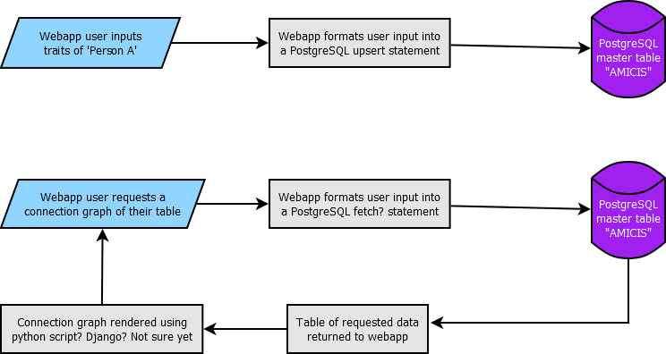

# Solodex

## Inverse social networking using graph theory.

Unfortunately, the name of this project will likely be changing, as the word "Solodex" has already been trademarked here: https://tsdr.uspto.gov/#caseNumber=97748575&caseSearchType=US_APPLICATION&caseType=DEFAULT&searchType=statusSearch.

That aside, the goal of this project is to create a webapp that allows end users to quickly jot down a dozen or so characteristics about new people that they meet. These characteristics will likely include name, approximate age, hair color, facial hair, approximate height, job/major, their main hobbies or interests, major personality traits, and probably many more things.

Importantly, a characteristic that will be added on each 'new person' submission on the webapp will be the names of the individuals that that person appears (or explicitly says) are their closest confidantes. This could mean close friends, relatives, or romantic partners. Because we are collecing these data points, which point to the strength of relationships with other individuals, we'll be able to create a detailed connection graph visually showing how connected each individual we meet is with each other, as well as the strength of those relationships. This portion of the project was greatly inspired by a fantastic video by adumb on YouTube, where he graphed the many connections between Wikipedia articles: https://www.youtube.com/watch?v=JheGL6uSF-4.

## Logic Flow Chart

Below is a preliminary flow chart for the two most basic uses of this webapp: sending new rows of information to the database, and requesting that data back in a visual form.



(made with Dia Diagram Editor: http://dia-installer.de/)

Obviously this flow chart is very broad, and the details of how exactly this webapp is going to work is still in flux. However, it's worth exploring the three elemnts that will be required in order for a rough draft of this webapp to work.

## Webapp Details

There are thousands of possible frameworks that could be chosen for the front end of this webapp, but I understand that using Django has been tossed out as a possible solution for this particular use case. Jackson, if you want to expand on your perspective for what framework we should be using/what frameworks you've used in the past, put that down here.

## Database Details

Not much has been set in stone for how the database is going to work, but there are a few knowns:

* The database infrastructure will be using PostgreSQL
* The database will be hosted by the webapp user locally on their own machine (laptop/desktop computer, self-hosting server, Rasberry Pi or equivalent, etc)
* Webapp users will have the option to connect their database with other webapp users, and build a (literal) social network supported by user gathered data, completely privately.
* The webapp user will have FULL CONTROL over ALL of their data. This means that this application will NOT send copies of this data to other users, data vendors, or the creators of this application. The webapp user maintains the right and the ability to delete, modify, or otherwise mess with their own collected data in whatever way they see fit. If the webapp user wants to wipe their database, they can, and the data will not leave any traces anywhere (a TRUE deletion of the data). Not in the cache of the webapp, not on the user's hosting setup, nowhere.

Other than these points, anything can and likely will change in this portion of the README to include more granular information about how exactly the database will work.

## Data Transfer Details

I've got the least idea on how this is going to work in the specifics. Are we going to use a Direct Database Access system or a Rest API? How can we ensure that the information pulled and pushed to the webapp user's database is encrypted, so that no digital middlemen can intercept and copy this data? What method would allow for the least amount of lag between requesting data and receiving a constructued visual, or in the pushing data step as well? Lots of questions need answered here.

## Project Ethics

This project is a data collection project on people. As such, there many, many creative ways to use the data gathered in this project in an evil, self-serving, greedy manner. Just read the Terms of Service for apps like Instagram, Facebook, TikTok, and many others, and you will soon see just how pervasive unethical data usage for the sake of greed is in our current digital world. This project is aimed at being as user-controlled as possible, and the hope of this project team is that humanity can gain the incredible benefits that data analytics can bring together real people in real life in a pseudo-organic manner, without the twisted incentives of financial gain distorting that goal. This is a proof of concept, hobby project to start with after all. The bottom line is, this project WILL NOT use user-collected data in any other manner than to help build an inverse social network, that is it.

## Future Ideas

* What if the database was encrypted in whatever location the webapp user puts it? Whether it's hosted on a tiny computer chip or on a mini server, I think it'd be a great idea if the only way that the data could be read in a human readable format was if on the webapp side, the user inputs the key to the sha256 encryption, and thus graphs could be plotted. The key could be chosen by the user when setting up the app, and that way even the communications between the database and the webapp would be even more difficult to break, because even if you could break the encryption on whatever security system that regular data packets use on the internet, you'd still just get a bunch of garbled letters and numbers. Is that completely unnecessary? Let me know - Mav
* What if one of the columns in the database was "timestamp" or something similar, using epoch time to avoid timezone-changing nonsense? That way, you could also have an "update entry" button if for example Person A cut their hair shorter, or dyed it, you could make a new row in the database that but have a different hair color noted in the hair color column, but the old entry could still exist. That way, if you made multiple entries about multiple people over time, you could eventually slice by Person A in the visual part of the webapp and see the changes that you've notated over time, and when those changes happened. Perhaps a feature to consider later than alpha_v1.0.0 that we're trying to make quick though. - Mav
* Ensure that this webapp works on Android phones, but also on as many high profile web browsers as we can, including Safari. That way, Apple users (who might not be able to download this app otherwise) could still go to a website-like thing in Safari and access their data plots and have the ability to add newly met people as well. Perhaps there's a better way to do that than through the browser on the phone, hmmm - Mav
* Consider the fact that some users might only have 100 rows in their table after a year of using this app. Maybe that's a bad estimation, but my point is that the amount of data being stored is pretty small. What if the webapp users could have the option of saving their database locally to their phone somewhere? That'd make needing to fetch the data from another device somewhere across the internet unnecessary, and perhaps make loading in data to the app and sending it to the 'database' on their phone even faster. Obviously this wouldn't scale for the other projects that we're considering building that could use a similar system to how this project is described in above sections, and if a user was linked with 5 other people, saving all of their data to their own local databases on their phones and having to routinely sync their data with their data-collecting buddies could be annoying, I'm not sure if this is actually that good of an idea. Just a thought. - Mav

# Problems to solve
- Figure out how to 'sync' to home server
- How do we build the 'graph'
  - Multiple different types of links


# Contribution
## Frontend/Client App
See the [README](./solodex/frontend-tauri/README.md) for the client app.

## Backend
See the [README](./solodex/README.md) for the backend, particularly the server application.

## Building
### Android
- Set up android dev dependencies
https://tauri.app/start/prerequisites/#android

```bash
# Initialize the project for android (this is a pain in the ass)

# If you get an error where the 'tauri' command
# is not in your path, you need to install it with cargo
cargo install tauri-cli


cargo tauri android init

# Dumps out available emulators
${ANDROID_HOME}/emulator/emulator -list-avds

# Starts the emulator
${ANDROID_HOME}/emulator/emulator -avd <ONE OF THE NAMES FROM THE PREVIOUS COMMAND>
```

- Once dependencies are met, you can...
```bash
  npm run tauri android dev

  # This will take a fat minute the first time, but once done, it should install Solodex on the emulator and you can perform testing.
```